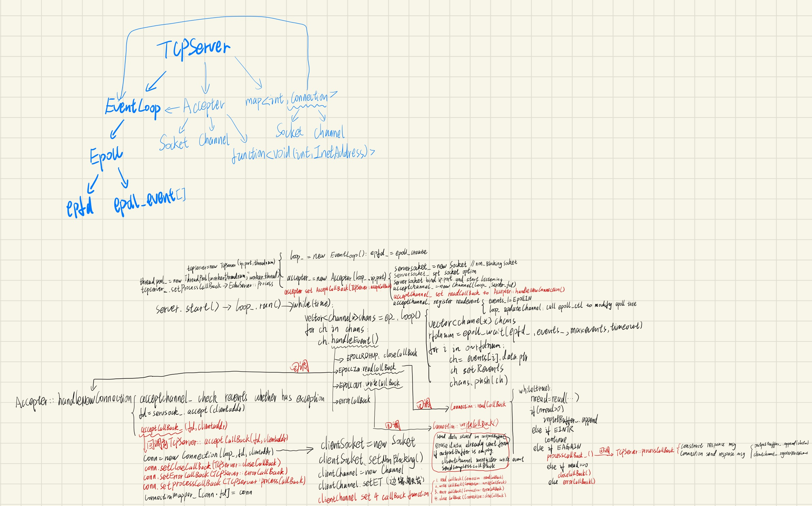
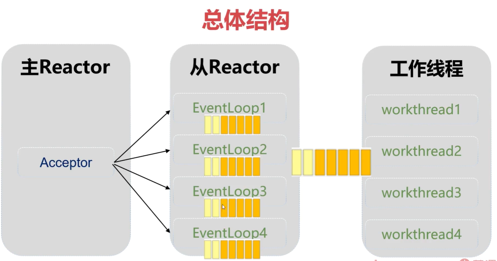

# 基于Reactor模式的高并发服务器
## 备注
.gitignore忽视了根目录下的bin文件夹和build文件夹，请手动创建
## 项目介绍
本项目使用C++语言开发了一个高并发服务器，基于Reactor模式构建，利用 `epoll` 进行事件管理，以实现高效的网络 I/O 操作。该服务器适合处理大量的并发连接请求，能够稳定运行并响应多个客户端的请求。项目设计简洁，便于扩展和维护，适用于构建高性能的网络服务器。

## 项目原理
### 项目框架图

### epoll的原理
`epoll` 是Linux下的高性能I/O多路复用模型，通过 `epoll`，可以监控大量的文件描述符事件（如读、写、异常等），一旦有事件发生，epoll 会通知应用程序处理相应的 I/O 操作。epoll 主要包含三个系统调用：
1. `epoll_create()`：创建一个 epoll 实例。
2. `epoll_ctl()`：向 epoll 实例中添加、删除或修改文件描述符。
3. `epoll_wait()`：等待事件发生，返回已触发的文件描述符集合。

### Reactor架构
Reactor 模式是一种事件驱动的处理架构，将事件监听和事件处理解耦，适合处理高并发需求。Reactor模式中的关键组件包括：
- **事件分发器**：负责监听事件（如 I/O 事件）并触发相应的处理。
- **事件处理器**：根据事件类型和状态，执行特定的处理逻辑。
- **资源管理器**：管理所需的资源（如网络连接和线程）以实现高效调度。

在本项目中，Reactor 模式利用 epoll 实现事件的监听和分发，通过独立的事件处理器处理不同类型的网络请求，确保了并发情况下服务器的稳定和响应速度。
### 多线程的主从Reactor模型
本项目采用了三大Reactor模型中高并发性能最好的多线程主从Reactor模型
- 单线程的Reactor模型不能发挥多核CPU的性能
- 运行多个事件循环，主事件循环运行在主线程中，从事件循环运行在线程池中
- 主线程负责创建客户端链接，然后将connection分配给从线程池处理
- 当从线程在事件循环中监听到来自客户的可读事件时，接收客户端发来的数据，然后将数据交给工作线程池中的线程处理
#### 从线程事件循环和业务处理的分离的必要性
如果某个子线程需要处理的业务数据复杂，那么子线程会长时间阻塞在业务处理代码上，相当于该子线程无法继续事件循环承担分配连接的任务，所以要再创建一系列的工作线程来分担子线程的业务处理工作
#### 从线程和工作线程的协同工作的详细说明
更新之后的模型，相当于Accepter中监听客户端的传入连接事件，accept到链接之后交给子线程管理，每个子线程都有各自的事件循环和各自的epoll红黑树来承载和客户的连接，时刻监听客户的请求，客户的请求到达之后，子线程再将对请求的处理分配给工作线程，工作线程处理完客户的数据之后再将处理后的数据写入输出缓冲区，子线程在监听读事件的同时也在监听写事件，一旦写就绪就可以将写缓冲区的数据发送出去。这样就能实现非常高效的并发业务处理
#### 多线程主从Reactor模型的优化方向
该模型如果没有实现动态线程数增长机制，则依然有一个问题，就是如果所有工作线程都被占满了，而子线程又不能处理业务数据，那么有可能业务处理请求会积压在子线程对工作线程的请求处理队列中无法被分配出去，此时的优化方向要么是增加动态增长工作线程数的机制，要么在业务方面优化，让业务处理的时间缩短。
### 实现异步通知线程事件循环
#### 为什么要异步通知事件循环

工作线程需要将处理之后的数据写入到自定义输出缓冲区，当系统级别的输出缓冲区变为可写之后就会触发可写事件，从线程就会回调到Connection中实际调用send的函数中，而从线程从自定义缓冲区中取数据的过程和工作线程将数据写入自定义输出缓冲区的过程可能造成多线程对共享区的同时访问问题，所以需要设计一套互斥机制来保护自定义输出缓冲区，加锁解锁在这个场景下太过频繁，消耗性能，所以我们采用eventfd来实现线程间的通信
#### 采用什么方法通知
通知线程的方法：条件变量、信号量、socket、管道、eventfd

事件循环阻塞在epoll_wait函数上，而条件变量和信号量都有自己的阻塞等待函数，不适合用于通知事件循环

socket, 管道, eventfd都是fd, 都可加入epoll，如果要通知事件循环，向其中写入数据即可
#### 介绍eventfd
创建：int eventfd(unsigned int initval, int flags);//第一个参数是初始值，第二个参数是标志位，有三个标志位

EFD_CLOEXEC: 当前进程创建子进程的时候，子进程不会继承父进程的efd

EFD_NONBLOCK: 创建一个非阻塞的event fd,后续的read调用在该阻塞的情况下不会发生阻塞，而是直接返回-1

SEMAPHORE: 最好配合EFD_NONBLOCK一起使用，加上这个标志位之后，efd变成了信号量的值，每次read都会给当前值-1，就像PV操作中的P操作

写：ssize_t write(int efd, void *buf, size_t size); //写操作会累加eventfd的值，buf的大小必须是8字节，成功返回写入的字节数，失败返回-1

读：ssize_t read(int efd, void *buf, size_t size);//读操作会一次性读取出eventfd的值，也就是说两次调用read，第二次调用会阻塞

我们将eventfd加入epoll之后，只要eventfd不为0就会触发读事件
#### 具体实现方法
具体实现步骤如下：

1. **创建 eventfd 并加入 epoll 监听**
   
   在每个从线程的事件循环中，创建一个 eventfd，并将其加入 epoll 监听。这样，eventfd 就能像普通的 socket fd 一样被 epoll_wait 监控。

   ```C++
   // 创建 eventfd
   int efd = eventfd(0, EFD_NONBLOCK | EFD_CLOEXEC);
   // 将 efd 加入 epoll 监听
   epoll_ctl(epollfd, EPOLL_CTL_ADD, efd, &event);
   ```

2. **工作线程通知子线程**
   
   当工作线程处理完业务数据后，需要通知从线程有新任务（如有数据需要发送）。此时，工作线程向 eventfd 写入数据（通常写入8字节的整数），触发子线程 epoll_wait 返回。

   ```C++
   uint64_t one = 1;
   write(efd, &one, sizeof(one)); // 通知子线程
   ```

3. **子线程响应 eventfd 事件**
   
   子线程的 epoll_wait 检测到 eventfd 可读事件后，说明有新任务到来。此时，子线程从 eventfd 读取数据（清除可读状态），然后从任务队列中取出任务并执行。

   ```C++
   if (eventfd 可读) {
       uint64_t cnt;
       read(efd, &cnt, sizeof(cnt)); // 清除事件
       // 处理任务队列中的任务
       doPendingTasks();
   }
   ```

4. **任务队列的使用**
   
   工作线程不能直接操作子线程的事件循环和缓冲区，而是将任务（如 Connection::sendInIOThread）封装为函数对象，加入子线程的任务队列。子线程在收到 eventfd 通知后，依次执行队列中的任务。

   ```C++
   // 工作线程添加任务
   loop_->addTaskToQueue(std::bind(&Connection::sendInIOThread, this, data));
   // 子线程在事件循环中处理
   void EventLoop::doPendingTasks() {
       std::queue<std::function<void()>> tasks;
       {
           std::lock_guard<std::mutex> lock(mutex_);
           tasks.swap(taskQueue_);
       }
       while (!tasks.empty()) {
           tasks.front()();
           tasks.pop();
       }
   }
   ```

### 正确使用智能指针
- 如果资源的生命周期难以确定，则应该使用shared_ptr来管理
- 类自己所拥有的资源用unique_ptr来管理，在类被销毁的时候，将会自动释放资源
- 不属于自己的资源，但是有使用权的资源，采用unique_ptr&或者shared_ptr来管理比较麻烦，裸指针比较合适

#### 介绍无名管道
创建：int pipe2(int pipefd[2],int flag);

写：ssize_t write(pipefd[1],"hello world",11);

读：ssize_t read(pipefd[0],void *buf,size_t size);
```C
int main(){
   int pipefd[2];//无名管道，存储管道读端和写端的fd，fd[0]读，fd[1]写
   if(pipe2(pipefd,0)==-1)
      printf("创建管道失败\n");
   const char *data="hello world";
   write(pipefd[1],"hello world",strlen(data));
   char buf[128]={0};
   ssize_t nread= read(pipefd[0],buf,sizeof(buf));
   printf("ret=%d, buf=%s\n",nread, buf);
   close(pipefd[0]);
   close(pipefd[1]);
}
```
## 项目结构
```
project-root
├── bin             # 可执行文件目录
├── build           # 编译生成的文件
├── etc             # 日志输出配置文件
├── include         # 项目所需头文件
├── log             # 运行过程中产生的日志文件
├── scripts         # 编译脚本和运行脚本
│   └── build.sh    # 编译脚本
└── src             # 源代码文件
    ├── main.cpp    # 主程序文件
    └── impl        # 头文件对应的实现文件
```
## 关键bug修复记录
### Connection::sendInIOThread调用时参数不一致问题
因为后期要解决多线程操作共享区的问题，工作线程不能自己直接将处理后的数据加上报头然后放到自定义输出缓冲区，改成了工作线程通过eventfd通知从线程将处理之后的数据加上报头然后由从线程将数据放到自定义输出缓冲区。
起初的设计方案：  
是在EventLoop中增加任务队列  
```C++
 std::queue<std::function<void()>> taskQueue_;
```
其中的元素存放函数对象，代表要执行的任务，工作线程在Connection::send内部调用EventLoop::addTaskToQueue将Connection::sendInIOThread函数作为任务加入任务队列 
```C++
loop_->addTaskToQueue(std::bind(&Connection::sendInIOThread, this, data));
```
addTaskToQueue会在内部将函数对象放入队列，并调用EventLoop::wakeup()唤醒相应的从线程，而从线程的EventLoop中已经利用内部的Channel注册了wakeupfd的可读事件  
```C++
void EventLoop::setWakeChannel()
{
    wakeChannel_ = std::make_unique<Channel>(shared_from_this(), wakeupfd_);
    wakeChannel_->setReadCallBack(std::bind(&EventLoop::handleWakeUp, this));
    wakeChannel_->registerReadEvent();
}
```
EventLoop::setWakeChannel 会在TCPServer初始化的时候调用，确保每个从事件循环都通过内部的Channel监听并注册了wakeupfd的可读事件，保证了从事件循环可以被wakeupfd唤醒并执行相应的回调函数handleWakeUp 
```C++
void EventLoop::handleWakeUp()
{
    uint64_t val;
    read(wakeupfd_, &val, sizeof(val)); // 读出wakeupfd_的值，如果不读取，那么这个值不会清零，相当于唤醒的闹铃声一直不关   
    std::lock_guard<std::mutex> guard(mutex_); // 给任务队列加锁
    while (taskQueue_.size() > 0)
    {
        auto fn = std::move(taskQueue_.front()); // 如果函数对象在调用std::bind的时候捕获了复杂的变量，那内部就需要存储，std::move避免了拷贝操作，使得fn直接接管了内部的资源
        taskQueue_.pop();
        fn();
    }
}
```
经过调试验证后发现，function函数对象的模版参数不能为空，原本以为调用fn之后内部是可以检测到bind函数调用时绑定的数据的，但是并不能，我采用了以下几种方案解决问题：  
1. 将function函数对象的类型改为function\<std::string\>，string本身就记录了数据的长度，免去了之前传入const char *还要再额外传入数据长度的问题
2. 函数对象类型更改之后面临调用时需要传入参数的问题，而data并不在handleWakeUp函数中，经过查gpt之后，得知传入任意参数即可，调用时会忽略手动传入的参数，采用bind时绑定的参数，事实证明仍然不行
3. 此时我觉得靠bind将参数绑定到函数对象中并不靠谱，决定另辟蹊径，将任务队列的元素类型改为键值对，键存放函数对象，值存放实际的数据，这样就能确保一定能将要传入的数据和函数对象对应起来  
```C++
std::queue<std::pair<std::function<void(std::string)>,std::string>> taskQueue_;
```
更改所有相关函数的参数和内容：  
```C++
void Buffer::appendWithHead(std::string data)
{
    size_t size = data.size();
    logger.logMessage(DEBUG, __FILE__, __LINE__, "已经进入appendWithHead,数据为%s，大小为%d", data.c_str(), data.size());
    buf_.append((char *)&size, sizeof(int)); // 添加数据头
    buf_.append(data);                       // 添加实际数据
    logger.logMessage(DEBUG, __FILE__, __LINE__, "appendWithHead调用完成,此时自定义缓冲区中的数据为%s", buf_.c_str());
}

void EventLoop::addTaskToQueue(std::function<void(std::string)> fn,std::string data)
{
    {
        std::lock_guard<std::mutex> guard(mutex_);
        std::pair<std::function<void(std::string)>, std::string> mypair(fn, data);
        taskQueue_.push(mypair);
    }
    // 唤醒从线程
    wakeup();
}

void EchoServer::wokerThreadBehavior(SharedConnectionPointer conn, std::string message)
{
    logger.logMessage(DEBUG, __FILE__, __LINE__, "EchoServer::workerThreadBehavior() called, worker thread id=%d", syscall(SYS_gettid));
    message = "reply:" + message;
    // 有可能是工作线程或者从线程执行下面这段代码
    conn->send(message);
}

void Connection::send(std::string data)
{
    if (disconnect_ == true)
    {
        return;
    }
    if(loop_->isIOThread()){
        sendInIOThread(data);
    }
    else
    {
        loop_->addTaskToQueue(std::bind(&Connection::sendInIOThread, this, std::placeholders::_1),data);
    }
}

void Connection::sendInIOThread(std::string data){
    outputBuffer_.appendWithHead(data);
    clientchannel_->registerWriteEvent();
}

void EventLoop::handleWakeUp()
{
    logger.logMessage(DEBUG, __FILE__, __LINE__, "EventLoop::handleWakeUp() called, thread id is %d.", syscall(SYS_gettid));
    uint64_t val;
    read(wakeupfd_, &val, sizeof(val)); // 读出wakeupfd_的值，如果不读取，那么这个值不会清零，相当于唤醒的闹铃声一直不关
    std::lock_guard<std::mutex> guard(mutex_); // 给任务队列加锁
    while (taskQueue_.size() > 0)
    {
        auto pair = std::move(taskQueue_.front());
        taskQueue_.pop();
        auto fn=pair.first;
        auto str = pair.second;
        logger.logMessage(DEBUG, __FILE__, __LINE__, "已经将任务从任务队列中取出，数据部分为%s",str.c_str());
        fn(str);//关键就在于这一句才能真正将数据传进去
    }
}
```
经过上面的改造之后，终于可以实现将键值对所代表的任务取出之后将数据传入函数实现数据的发送
## 如何运行项目
1. 首先运行编译脚本：
   ```bash
   ./scripts/build.sh
   ```
2. 编译完成后，执行 bin 目录中的可执行文件启动服务器：
   ```bash
   ./bin/epollserver
   ```
